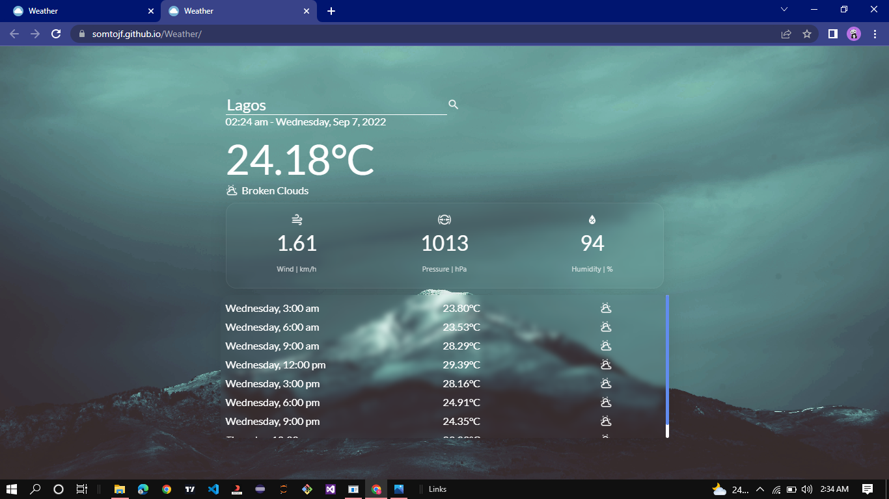

# Weather App 
View current and forecast weather data of thousands of cities around the world.

## [View Live](https://somtojf.github.io/Weather/)
## Getting Started
In order to setup and work on this project on your own, you will need to:
1. Fork and Clone this project
2. Once you have cloned this project, you can install the required dependencies by using: npm install
3. A live demo of the project can be started by using: ```npm start```
4. Distribution files can be produced using: ```npm run build```
## Features
* Displays Current weather of thousands of cities around the world.
* Return data from your last search anytime you load the web app.
* Get current date and time of any city in the world.
* Displays weather data for every three hours up to the next 24 hours.
## Contributions 🤝
Contributions, Issues and feature requests are very much welcome!
## Show your Support
If you got until here, show your love hitting the ⭐️ button, I'd really appreciate it.
## Resources and References
* [Jack Finnigan](https://unsplash.com/@jackofallstreets)
* [Pan Xiaozhen](https://unsplash.com/@zhenhappy)
* [Jessica Fadel](https://unsplash.com/@jessicalfadel)
* [Luke Hodde](https://unsplash.com/@lukehodde)
* [Matheus Barro](https://www.pexels.com/@potsclam/)
* [Billel Moula](https://www.pexels.com/@billelmoula/)
* [PhotoMIX Company](https://www.pexels.com/@wdnet/)
* [Gilbert Nathaniel](https://unsplash.com/@itsoonz)
* [Suzanne Jutzeler](https://www.pexels.com/@suju/)
* [Vista Wei](https://unsplash.com/@weista)
* [Alex Gindin](https://unsplash.com/@alexgindin)
* [KoolShooters](https://www.pexels.com/@kool-shooters/)
* [Sebin Thomas](https://unsplash.com/@sebinthomas)
* [James Zwadlo](https://unsplash.com/@jzwadlo)
* [Michiel van Kaam](https://unsplash.com/@michielvkaam)
* [Milin John](https://unsplash.com/@milinjohn)
* [Lee Junda](https://unsplash.com/@leejunda)
* [Tasos Mansour](https://unsplash.com/@mantasos)
* [Material Design Icons](https://materialdesignicons.com/)